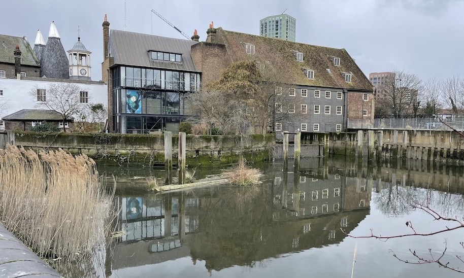

# House Mill Sonar Box

Project with volunteers at House Mill to monitor flood waters in a grade 1 listed building.



Using Maxbotix MB7389 (5m range) - https://maxbotix.com/pages/hrxl-maxsonar-wr-datasheet 


Also using tide information from https://pla.co.uk/Safety/Tidal-information 

## To do 
- grafana view of data is behind firewall in CE lab, external view needed.

# Sensor Box Scripts

Sensor Box at House Mill 51.527220, -0.007761

## sonarbox-scripts/sonar-camera.py
Script to take time lapse photos every 2 mins when water is above floor - script defaults to 1000mm

## sonarbox-scripts/sonar-median-mqtt.py
Takes median of 11 readings coming in from Serial (Arduino sketch) and then posts to mqtt broker. Runs every 10 minutes.

# Other scripts (running on RPi in office)

Note: 
Requires: 
```
pip install beautifulsoup4
pip install pytz
pip install selenium
pip install paho-mqtt
```
Also had to install chromedriver to use selenium
```
sudo apt-get install chromium-chromedriver
```

## server-scripts/river-level.py
Webscrapes river level info from https://riverlevels.uk/ and posts them to mqtt broker every 15 mins. 

Lea Bridge Coordinates: 51°34'4"N 0°3'3"W (51.567832,-0.051025)

Silvertown Tidal Coordinates: 51°29'51"N 0°3'9"E (51.497504,0.052616)

Tower Pier Tidal Coordinates: 51°30'24"N 0°4'43"W (51.506753,-0.078706)

https://riverlevels.uk/levels/greater-london

## server-scripts/pla.py
Webscrapes tide / river level info from http://www.pla.co.uk/ and posts them to mqtt broker every 15 mins. 

Charlton 51.496765, 0.034353

Silvertown 51.498080, 0.039556

Tilbury 51.449332, 0.349288

Tower 51.505296, -0.075174

## sonarbox-scripts/config.py (.gitignored)
Passwords file containing following information:
mqttusername="xxx" 
mqttpassword="xxx"

# Arduino Sketches 

## arduino-sketches/maxbotix7389read
Basic sketch to read from sensor using pin 3

## arduino-sketches/maxbotix7389read_7seg
Basic sketch to read from sensor and display on 7 segment display

## arduino-sketches/maxbotix7389read_TTL
Basic sketch to read from sensor using pin 5


## Crontab settings

On sensor box:
```
1-59/2 * * * * /usr/bin/python3 /home/pi/Desktop/sonar-camera.py
*/10 * * * * /usr/bin/python3 /home/pi/Desktop/sonar-median-mqtt.py  >> /home/pi/Desktop/sonar.log 2>&1
```
on office RPi:
```
1,16,31,46 * * * * /usr/bin/python3 /home/pi/Desktop/river-level.py >> /home/pi/Desktop/river.log 2>&1
1,16,31,46 * * * * /usr/bin/python3 /home/pi/Desktop/pla.py >> /home/pi/Desktop/pla.log 2>&1
```

## Wiring

Arduino Uno:
- Maxbotix: 5V, GND + Maxbotix pin 3 to Arduino A0
- 7seg: 3.3V, GND + SDA, SCL 
(SDA on 7seg is end pin opposite corner to 3.3V and pin A4 on Arduino Uno)
(SCL on 7seg is second pin opposite corner to 3.3V and pin A5 on Arduino Uno)

RPi:
- RPi cam v2.1 NOIR used
- Initially used https://cpc.farnell.com/cyntech/lisiparoiir-01/rpi-ir-board-for-pi-camera/dp/SC13919 which was controlled via GPIO4 on pi - but LED's not bright enough so used separate source.

## Sensor Locations

Sensor Box at House Mill, UCL, 51.527220, -0.007761

Charlton, PLA, 51.496765, 0.034353

Silvertown, PLA, 51.498080, 0.039556

Tilbury, PLA, 51.449332, 0.349288

Tower, PLA, 51.505296, -0.075174

Lea Bridge, River Levels, 51.567832,-0.051025

Silvertown Tidal, River Levels,51.497504,0.052616

Tower Pier Tidal, River Levels,51.506753,-0.078706