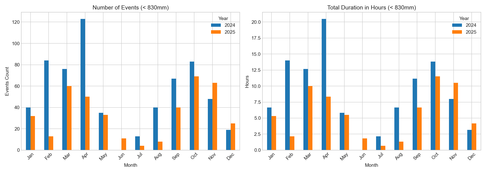
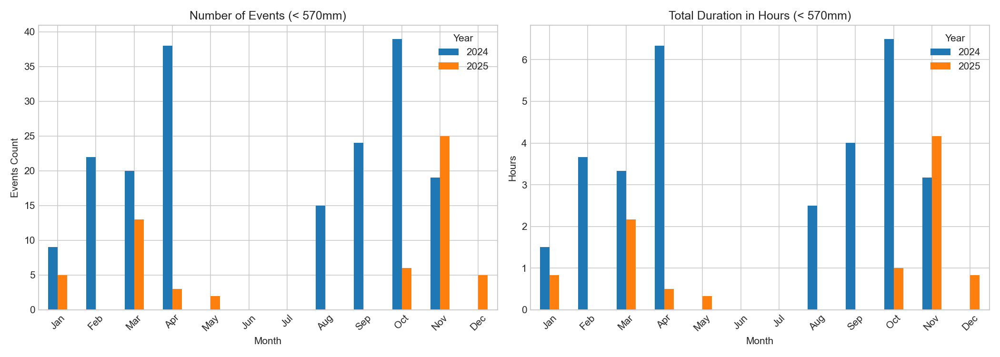

# Water Height Comparison (2024 vs 2025)

This document compares the sonar distance data across the captured years, tracking flood events using the 830mm and 570mm thresholds.

## Threshold: < 830mm

### Yearly Statistics
| Year | Total Events | Total Duration (Hrs) | Avg Duration (Mins) | Std Dev (Mins) | Daytime Events (8am-7pm) % |
|---|---|---|---|---|---|
| 2024 | 628 | 104.66 | 10.00 | 0.02 | 51.1% |
| 2025 | 408 | 68.00 | 10.00 | 0.01 | 54.7% |

### Number of Events (Monthly)
| Month | 2024 | 2025 |
|---|---|---|
| Jan | 40 | 32 |
| Feb | 84 | 13 |
| Mar | 76 | 60 |
| Apr | 123 | 50 |
| May | 35 | 33 |
| Jun | 0 | 11 |
| Jul | 13 | 4 |
| Aug | 40 | 8 |
| Sep | 67 | 40 |
| Oct | 83 | 69 |
| Nov | 48 | 63 |
| Dec | 19 | 25 |

### Total Duration in Hours (Monthly)
| Month | 2024 | 2025 |
|---|---|---|
| Jan | 6.67 | 5.33 |
| Feb | 14.00 | 2.17 |
| Mar | 12.67 | 10.00 |
| Apr | 20.50 | 8.33 |
| May | 5.83 | 5.50 |
| Jun | 0.00 | 1.83 |
| Jul | 2.17 | 0.67 |
| Aug | 6.67 | 1.33 |
| Sep | 11.17 | 6.67 |
| Oct | 13.83 | 11.50 |
| Nov | 8.00 | 10.50 |
| Dec | 3.17 | 4.17 |

## Threshold: < 570mm

### Yearly Statistics
| Year | Total Events | Total Duration (Hrs) | Avg Duration (Mins) | Std Dev (Mins) | Daytime Events (8am-7pm) % |
|---|---|---|---|---|---|
| 2024 | 186 | 31.00 | 10.00 | 0.03 | 52.2% |
| 2025 | 59 | 9.83 | 10.00 | 0.02 | 64.4% |

### Number of Events (Monthly)
| Month | 2024 | 2025 |
|---|---|---|
| Jan | 9 | 5 |
| Feb | 22 | 0 |
| Mar | 20 | 13 |
| Apr | 38 | 3 |
| May | 0 | 2 |
| Jun | 0 | 0 |
| Jul | 0 | 0 |
| Aug | 15 | 0 |
| Sep | 24 | 0 |
| Oct | 39 | 6 |
| Nov | 19 | 25 |
| Dec | 0 | 5 |

### Total Duration in Hours (Monthly)
| Month | 2024 | 2025 |
|---|---|---|
| Jan | 1.50 | 0.83 |
| Feb | 3.67 | 0.00 |
| Mar | 3.33 | 2.17 |
| Apr | 6.33 | 0.50 |
| May | 0.00 | 0.33 |
| Jun | 0.00 | 0.00 |
| Jul | 0.00 | 0.00 |
| Aug | 2.50 | 0.00 |
| Sep | 4.00 | 0.00 |
| Oct | 6.50 | 1.00 |
| Nov | 3.17 | 4.17 |
| Dec | 0.00 | 0.83 |

